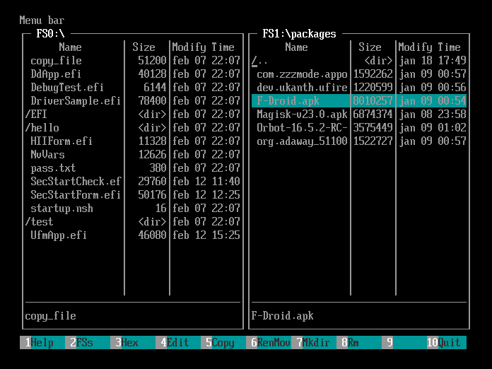
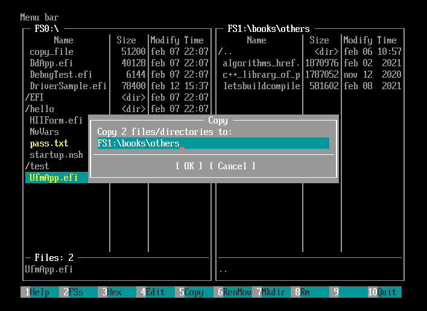

# UEFI File Manager (UFM)
A dual pane file manager with a text based user interface for UEFI Shell environment (requires v2.0 or higher). The application is based on the [TianoCore EDK II](https://www.tianocore.org/) development environment. Distributed under the BSD-2-Clause Plus Patent License.


## Features:

* Support all available text-modes on standard output
* Work with devices that support the Simple File System Protocol
* Execute an application
* Use internal `edit` and `hexedit` editors
* Copy, create, move/rename, remove files/directories


## Installation:
1) Move all files from Library to ShellPkg/Library

2) Add the following line to ShellPkg/ShellPkg.dsc, **section "Components"**:

```
ShellPkg/Library/UefiShellUfmCommandLib/UefiShellUfmCommandLib.inf
```

### If you want to integrate UFM in Shell:
1) Add the following line to ShellPkg/ShellPkg.dsc, **section "LibraryClasses"**, in build of any version of the shell:

```
ShellPkg/Application/Shell/Shell.inf {
	...
	<LibraryClasses>
		...
		NULL|ShellPkg/Library/UefiShellUfmCommandLib/UefiShellUfmCommandLib.inf # <- add this line
}
```

### If you want standalone application:
1) Move all files from Application, Include to ShellPkg/Application and ShellPkg/Include

2) Add the following lines to ShellPkg/ShellPkg.dsc:

**Section LibraryClasses.common:**

```
UfmCommandLib|ShellPkg/Library/UefiShellUfmCommandLib/UefiShellUfmCommandLib.inf
```

**Section Components:**

```
ShellPkg/Application/UfmApp/UfmApp.inf
```

3) Add the following line to ShellPkg/ShellPkg.dec, **section "LibraryClasses"**:

```
UfmCommandLib|Include/Library/UfmCommandLib.h
```


## Usage:

```
Shell> ufm
```

This example of launching an application is possible if it's integrated in the Shell. In other case, go to the desired file system and run **UfmApp.efi**

The app doesn't currently support command line arguments

### Controls:

There is no mouse support.

Keyboard Inputs:

```
- UP ARROW / DOWN ARROW: move to the next / prev item or scroll a line up / down
- TAB: move to the next panel
- ENTER: follow the current link
- SPACE: select the file
- F1-F10: special commands
```


## Screenshots:






## Useful resources & documentation:

[UEFI Shell Specification Version 2.2](https://uefi.org/sites/default/files/resources/UEFI_Shell_2_2.pdf)

[EDK II Documentation](https://github.com/tianocore/tianocore.github.io/wiki/EDK-II-Documentation)
